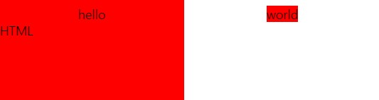

# [개요]설치 및 기본사용법

# HTML(Hyper Text Markup Language)이란
페이지의 제목, 문단, 표, 이미지, 동영상 등 웹의 구조를 담당

# 태그의 기본 구조
꺽쇠괄호로 감싸진 태그와 태그에 감싸진 내용까지 포함하여 하나의 요소(Element)라고 부른다.
|구성|설명|
|--|--|
|\<태그>|시작(열린) 태그|
|속성="값"|속성(Attribute),값(Value) 태그의 기본 기능을 확장해서 사용할 수 있게 해준다.|
|내용|요소의 내용(Contents)|
|\</태그>|종료(닫힌) 태그|
```html
<태그 속성="값">내용</태그>
```

# 기본 문법
- 프로그램을 실행했을때 index라는 이름을 가진 html파일을 우선적으로 찾아서 열게된다.
- "!"작성 후 탭 혹은 엔터키를 누르면 기본적인 내용이 자동으로 완성된다.
```html
// index.html
<!DOCTYPE html>
<html lang="en">
<head>
  <meta charset="UTF-8">
  <meta name="viewport" content="width=device-width, initial-scale=1.0">
  <title>Document</title>
</head>
<body>
  
</body>
</html>
```

# 부모와 자식 관계의 이해
- 특정 요소의 기준으로 보는 관계
  - 부모요소 : 자기자신을 감싼 바로 위 요소
  - 자식요소 : 자기자신이 감싼 바로 아래 요소
  - 상위(조상)요소 : 부모의 부모, 자신을 감싼 모든요소
  - 하위(후손)요소 : 자식의 자식, 자신이 감싼 모든요소
- 부모 자식관의 관계를 가시적으로 표현하기 위해 자식을 들여쓰기를 하게 된다.
```html
<div>           
  <div>         
    <div>       
      Hello HTML
    </div>
  </div>
</div>
```

# 빈(Empty) 태그
- 기본적인 태그는 열린태그와 닫힌태그가 하나의 세트로 요소라는 개념으로 존재하지만, 닫힌태그가 없어 안에 내용(Contents)를 넣을 수 없는 그래서 비어있는 태그이다.
- 빈 태그는 "/"를 뒤쪽에 넣어주는 방식으로 표현한다.
- 빈 태그는 속성을 지정해주지 않으면 사용에 제한이 크다.
```html

```

# 인라인(Inline)요소와 블록(Block)요소
요소가 화면에 출력되는 특정으로, 크게 2가지로구분된다.
- 인라인(Inline) : 글자를 만들기 위한 요소
  - 특징 
    - 인라인 요소는 줄바꿈을 하는 행위를 하나의 띄어쓰리고 해석하게 된다.
      ```html
      <span>hello</span>
      <span>world</span>
      //hello world
      <span>hello</span><span>world</span>
      // helloworld
      ```
    - 인라인 요소는 하나의 글자로 취급되며, 왼쪽에서 오른쪽으로 쌓이게 된다.(수평으로 쌓인다)
    - 인라인 요소의 사이즈는 요소의 내용(Contents)의 크기만큼 `자동으로 줄어든다`
    - 인라인 요소에 적용할 수 없는 style들(적용해도 반응하지 않음)
      - width,height
      - Y축padding(적용된거처럼만 보인다.),Y축margin
      ```html
      <div>
        <span style="padding:100px; background-color:red">hello</span>
        <span style="margin:100px; background-color:red">world</span>
      </div>
      <div>
        HTML
      </div>
      ```
      
    - 인라인 요소 내부에는 블록요소가 자식요소로 들어갈 수 없다.
- 블록(Block) : 상자(레이아웃)를 만들기 위한 요소
  - 요소가 수직으로 쌓이며 `X축이 부모요소의 크기만큼 최대한 늘어나려고 한다`.
  - 인라인 요소와 다르게 너비, 여백이 적용한 style대로 늘어나고 줄어든다.
  - 자식요소로 블록요소, 인라인요소 모두 가질 수 있다.

# 전역 속성
태그의 속성들은 특정태그 내에서만 사용할 수 있다. 하지만 일부 속성들은 모든 태그에서 사용이 가능한데이를 전역속성 이라고 한다.
|전역 속성|값|이름|
|--|--|--|
|title|"택스트"|요소의 정보나 설명을 지정하는 속성이다. 요소에 마우스를 올려두면 튤팁같은 요소가 나온다.|
|style|"속성명:속성값;..."|요소에 적용할 스타일(CSS)을 지정|
|class|"택스트"|요소를 지칭하는 `중복가능`한 이름|
|id|"택스트"|요소를 지칭하는 `고유`한 이름|
|data-이름|"데이터"|요소에 데이터를 지정|
## title
```html
<a href="https://www.naver.com/" title="네이버로 바로가기">Naver</a>
```
## style
```html
<div style="width:100px;hegiht:100px;background-color:red;"/>
```
## class
```html
<div class="container"/>
```
## id
```html
<div id="unique-container"/>
```
## data-이름
```html
<!--HTML-->
<div data-fruit-name="apple">사과</div>
<div data-fruit-name="banana">바나나</div>
```
```js
// JavaScript
const els = document.querySelectorAll('div');
els.forEach(el=>console.log(el.dataset.fruitName))
// apple
// banana
```