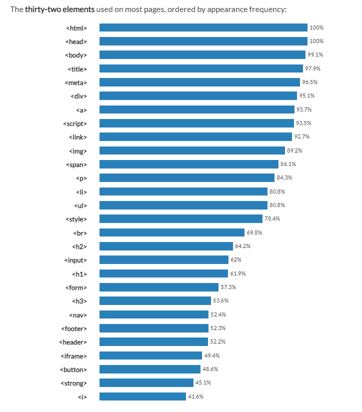

# [주요기능·태그]태그의 종류와 기능
HTML의 태그의 개수는 대략 130여개정도가 된다. 하지만 사용하는 태그는 대략 25개 정도 뿐이다. 그러니 모든 태그의 사용법을 숙지하지 않아도 괜찮다.
- 태그 종류및 사용법 확인 : https://www.tcpschool.com/html-tags/intro

# 핵심 요소 정리
## div태그(Block)
div(Division)태그는 특별한 의미가 없는, 레이아웃의 구분을 위한 요소
## h1~h6태그(Block)
제목을 표현하는 요소이다. 그 중요도에 따라 1~6까지의 넘버링을 명시하며 숫자가 작을수록 더 중요한 제목을 의미한다.
## p태그(Block)
p(Paragraph)태그는 어떠한 문장을 구분하는 요소이다.
## img태그(Block)
img(Image)태그는 이미지를 삽입하는 요소이다.
## ul태그(Block)
ul(Unordered List)태그는 순서가 필요없는 목록의 집합이다.
## li태그(Block)
li(listItem)태그는 목록 내 각 항목을 의미한다.
## a태그(Inline)
a(Anchor)는 다른/같은 페이지로 이동하는 하이퍼링크를 지정하는 요소
## span(Inline)
특별한 의미가 없는 구분을 위한 요소로 택스트를 내용으로 가진다.
## input(Inline-Block)
사용자가 데이터를 입력하는 요소이다. 
기본적으로 Inline요소이지만 block의 몇가지 특성을 추가적으로 사용할 수 있어서 Inline-Block이다.(inline요소처럼 왼쪽에서 오른쪽으로 쌓이지만 block요소처럼 너비와 여백의 style을 줄 수 있다.)
## table(table)
표 요소, 행(Row)과 열(Column)의 집합 
table요소는 block요소지만 더 엄밀히 따지면 table요소이다.
행(Row)은 tr태그로 이루고, 열(Column)은 td태그로 이룬다.